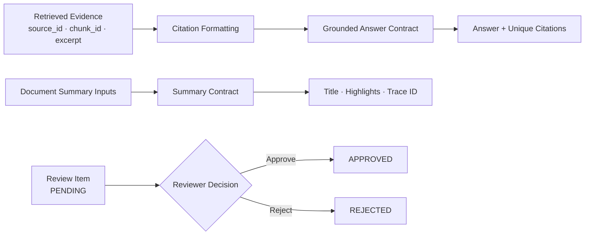
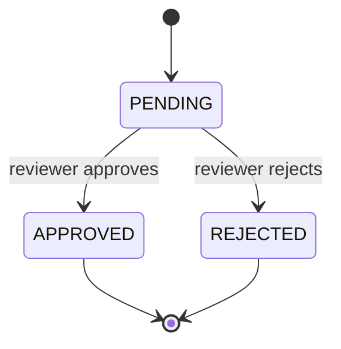
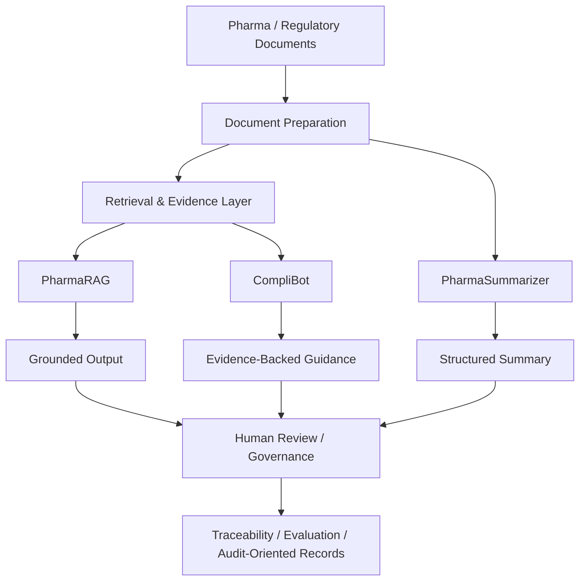

# Pharma AI Platform

### Regulated Document Intelligence · Grounded Answers · Structured Summaries · Human Review

Pharma AI Platform is a curated engineering showcase for **AI-assisted pharmaceutical and regulatory document workflows** with an emphasis on grounding, citations, structured outputs, traceability, and human review.

The broader project direction brings together three complementary capabilities:

- **PharmaRAG** — evidence-grounded question answering over pharmaceutical and regulatory documents
- **PharmaSummarizer** — structured document summarization
- **CompliBot** — compliance- and SOP-oriented guidance with evidence and review support

> **Public repository scope:** the current public repository contains portfolio-safe contracts and tests for grounded-answer, summary, citation, and review-state behavior. It does not expose or claim the full retrieval, embedding, ranking, LLM, UI, or persistence implementation.

---

## Problem

Pharmaceutical and regulated-document workflows require more than generating fluent text.

A useful AI-assisted system should be able to answer questions such as:

- What source supports this answer?
- Which document chunk produced the evidence?
- Can duplicate citations be normalized?
- Can summaries be returned through a predictable structure?
- Can an output be traced through a review workflow?
- Can a reviewer explicitly approve or reject an item?
- Can the system prevent an already-decided review item from being silently changed?
- Can these behaviors be tested independently from a specific model provider?

Pharma AI Platform treats **grounding, traceability, review, and structured outputs** as first-class engineering concerns.

---

## Public Showcase Architecture

The current public repository focuses on small, deterministic contracts that sit between AI/retrieval components and downstream application or review workflows.



This public layer demonstrates how outputs can be made **structured, traceable, and reviewable** without publishing the complete underlying document-intelligence implementation.

---

## Publicly Implemented Capabilities

### Retrieval Evidence Contract

`RetrievalEvidence` represents evidence through:

- `source_id`
- `chunk_id`
- `excerpt`

This gives downstream code a stable structure for associating an answer with supporting source material.

### Stable Citation Identity

`format_citation()` converts evidence identity into a predictable citation representation:

```text
source_id#chunk-chunk_id
```

For example:

```text
guideline-a#chunk-7
```

The goal is not citation styling; it is **stable source/chunk identity** that can be passed through later application layers.

### Grounded Answer Contract

`build_grounded_answer()` accepts an already-produced answer and retrieved evidence, then returns a `GroundedAnswer` containing:

- normalized answer text
- unique citations

Duplicate citation identities are removed while preserving order.

The function intentionally does **not** claim to perform retrieval, ranking, embedding, chunking, prompting, or model generation.

### Structured Summary Contract

`build_summary_result()` returns a `SummaryResult` containing:

- title
- cleaned highlights
- trace ID

The contract:

- trims title text
- removes empty highlights
- normalizes highlight text
- provides a safe fallback title
- preserves traceability through `trace_id`

Actual pharmaceutical summarization heuristics are outside the current public showcase.

### Human Review State Contract

`ReviewItem` models a minimal human-review workflow.

Supported states:

```text
PENDING
APPROVED
REJECTED
```

`transition_review()` enforces several rules:

1. a reviewer identity is required
2. only `PENDING` items may be decided
3. the target state must be `APPROVED` or `REJECTED`
4. the reviewer identity is recorded in the resulting item

This prevents arbitrary or repeated state changes through the public contract.

---

## Review Workflow



The public implementation intentionally treats approval and rejection as terminal decisions for this simplified showcase.

---

## Engineering Principles

| Concern | Current Public Approach |
|---|---|
| Grounding | Answers carry explicit citation identities |
| Evidence identity | Source and chunk IDs are preserved |
| Duplicate handling | Repeated citation identities are de-duplicated |
| Structured output | Answers and summaries use typed dataclass contracts |
| Traceability | Summary outputs retain a `trace_id` |
| Human review | Review items use explicit states |
| Reviewer accountability | Reviewer identity is required for a decision |
| State integrity | Already-decided review items cannot be decided again |
| Testability | Core behavior is deterministic and independent of model providers |

---

## Broader Platform Direction

The complete project direction is larger than the current public showcase.

Conceptually, the platform is organized around:



This diagram represents the **broader platform architecture and engineering direction**, not the implementation surface of the current public repository.

---

## Core Product Modules

### PharmaRAG

Target responsibility:

> evidence-grounded question answering over prepared pharmaceutical, regulatory, SOP, and quality documents.

Engineering areas include:

- document ingestion
- chunking
- embedding
- retrieval
- lexical / dense retrieval comparison
- hybrid retrieval
- metadata filtering
- reranking
- grounded answer construction
- citations and excerpts
- retrieval evaluation

These capabilities should only be described as publicly implemented when corresponding code is present in this repository.

### PharmaSummarizer

Target responsibility:

> structured summarization of individual pharmaceutical or regulatory documents.

Engineering areas include:

- structured summary schemas
- section-aware summarization
- key highlight extraction
- document metadata
- trace IDs
- output validation
- review-ready results

The current public repository exposes only the structured summary contract.

### CompliBot

Target responsibility:

> evidence-backed support for SOP and compliance-oriented questions.

Engineering areas include:

- compliance-relevant retrieval
- requirement extraction
- evidence presentation
- review workflow integration
- traceability

The current public repository exposes the review-state and output-contract foundations rather than a complete compliance assistant.

---

## Regulated-Domain Design Context

The project is intentionally shaped by concerns common to regulated pharmaceutical systems:

- source traceability
- controlled review
- explicit approval states
- data integrity
- reproducible outputs
- reviewer accountability
- evidence-backed responses
- validation and evaluation

These are **design concerns and engineering goals**.

This repository does **not** claim:

- 21 CFR Part 11 compliance
- validated GxP status
- production regulatory validation
- clinical validation
- autonomous regulatory decision-making

---

## Technology Stack — Current Public Showcase

- **Python 3.11**
- **Python dataclasses**
- **Python Enum**
- **pytest**
- **GitHub Actions**
- **Git**

The public showcase intentionally keeps the dependency surface small so the contracts can be tested independently from a model, vector database, web framework, or UI.

---

## Testing

The current public test suite verifies:

- citation formatting uses source and chunk identity
- grounded answers collect unique citations
- summary highlights are cleaned
- an empty summary title receives a safe fallback
- pending review items can be approved
- pending review items can be rejected
- already-decided review items cannot be decided again
- reviewer identity is required

Run the tests with:

```bash
python3 -m pytest -q
```

---

## Continuous Integration

GitHub Actions runs the validation suite on pushes and pull requests to `main`.

The CI workflow performs:

```text
Checkout
   ↓
Python 3.11 setup
   ↓
Install dependencies
   ↓
pip check
   ↓
Compile showcase + tests
   ↓
pytest
```

---

## Repository Structure

```text
.
├── .github/
│   └── workflows/
│       └── ci.yml
├── showcase/
│   ├── __init__.py
│   └── contracts.py
├── tests/
│   ├── __init__.py
│   └── test_showcase_contracts.py
├── pytest.ini
└── requirements.txt
```

---

## Running Locally

Create a virtual environment:

```bash
python3 -m venv .venv
source .venv/bin/activate
```

Install dependencies:

```bash
pip install -r requirements.txt
```

Run the tests:

```bash
python3 -m pytest -q
```

---

## Current Scope

The current public repository demonstrates:

- retrieval-evidence contracts
- stable citation identity
- grounded-answer output contracts
- structured summary contracts
- trace IDs
- human-review state transitions
- reviewer identity requirements
- automated tests
- CI

It does **not** currently expose or claim:

- PDF/document parsing
- production document ingestion
- chunking
- embeddings
- vector storage
- BM25 / lexical retrieval
- hybrid retrieval
- metadata filtering
- reranking
- live LLM generation
- a Streamlit or web application
- FastAPI endpoints
- persistent audit storage
- persistent review queues
- production authentication / RBAC
- validated GxP controls

---

## Roadmap

The broader flagship roadmap includes several engineering layers.

### Document Intelligence

- shared document parsing
- version-aware document metadata
- reusable chunk schema
- structured extraction

### Retrieval

- dense retrieval
- BM25 / lexical retrieval
- hybrid retrieval
- metadata filtering
- cross-encoder reranking

### Evaluation

- larger golden evaluation datasets
- Recall@K
- Precision@K
- MRR
- NDCG
- groundedness evaluation
- citation-correctness evaluation
- retrieval regression testing

### Answer Reliability

- structured answer contracts
- citation verification
- confidence-aware / fallback behavior
- explicit source attribution

### Governance and Review

- review workflow expansion
- audit-oriented event records
- authorization controls
- human-in-the-loop gates
- traceability across document, answer, and reviewer activity

### Platform Engineering

- API layer where architecturally justified
- durable persistence where justified
- Docker / CI
- integration and evaluation testing
- observability appropriate to the final runtime

Roadmap items are **not claimed as implemented** until corresponding evidence exists.

---

## Why This Project Matters

Many RAG demos stop at:

```text
Document → Embedding → Retrieval → LLM Answer
```

A regulated-domain system needs a wider engineering view:

```text
Document
   ↓
Versioned Preparation
   ↓
Retrieval
   ↓
Evidence
   ↓
Grounded / Structured Output
   ↓
Human Review
   ↓
Evaluation
   ↓
Traceability
```

Pharma AI Platform is intended to demonstrate that broader perspective: **document intelligence combined with grounding, evaluation, governance, and human review.**

---

## Important Note

This project is a **portfolio / research engineering showcase**.

It is **not a validated GxP production system**, is **not medical advice**, and is **not intended for autonomous clinical, safety, quality, or regulatory decision-making**.

Any production use in a regulated environment would require organization-specific validation, security, quality, data-governance, procedural, and regulatory controls beyond this repository.

---

## Portfolio Context

Pharma AI Platform is the primary pharmaceutical / regulated-AI project in this portfolio.

Related portfolio areas include:

- Agentic AI and AI platform engineering
- governed enterprise retrieval
- backend/API engineering
- full-stack AI products
- workflow reliability and systems engineering

**GitHub:** [chaitanyaAI-careers](https://github.com/chaitanyaAI-careers)
**LinkedIn:** [linkedin.com/in/chaitanyaai-careers](https://www.linkedin.com/in/chaitanyaai-careers/)
